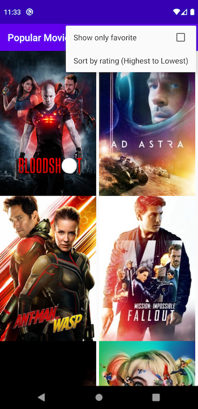
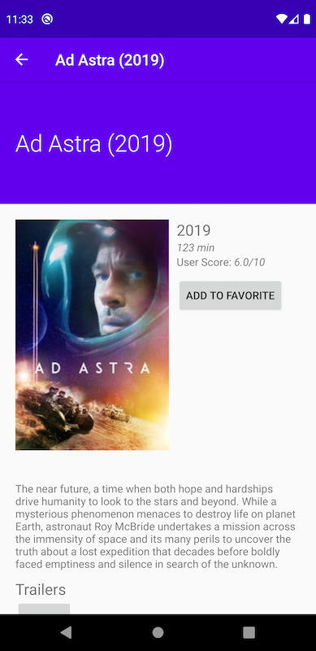

[the-movie-db]: https://www.themoviedb.org

# Popular Movies

<div align="center">



</div>


This application is a demo app that fetches movies from the [themoviedb.org][the-movie-db]. A user can sort the movies by either popularity or rating.

## Requirements

You must have an API KEY from [themoviedb.org][the-movie-db] and store in [app/application.properties](./app/application.properties).

```shell
cat << EOF > app/application.properties
TMDB_API_KEY="803xxxxxxxxxxxxxxxxxxxxxx"
EOF
```
